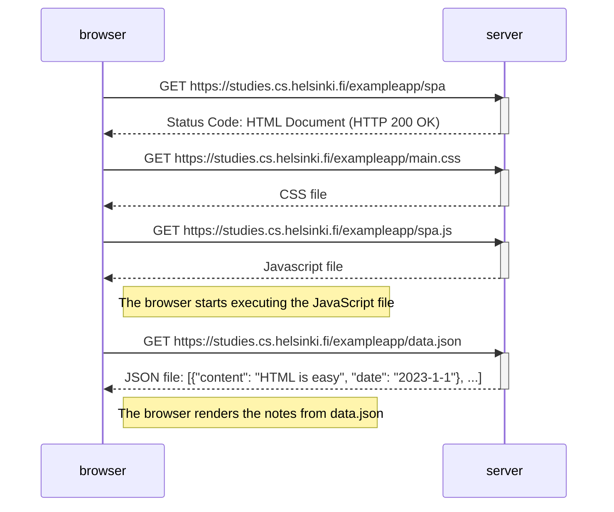

```mermaid

sequenceDiagram
  participant browser
  participant server

  browser->>server: GET https://studies.cs.helsinki.fi/exampleapp/spa 
  activate server
  server-->>browser: Status Code: HTML Document (HTTP 200 OK)
  deactivate server

  browser->>server: GET https://studies.cs.helsinki.fi/exampleapp/main.css 
  activate server
  server-->>browser: CSS file
  deactivate server

  browser->>server: GET https://studies.cs.helsinki.fi/exampleapp/spa.js 
  activate server
  server-->>browser: Javascript file
  deactivate server

  Note right of browser: The browser starts executing the JavaScript file

  browser->>server: GET https://studies.cs.helsinki.fi/exampleapp/data.json 
  activate server
  server-->>browser: JSON file: [{"content": "HTML is easy", "date": "2023-1-1"}, ...]
  deactivate server

  Note right of browser: The browser renders the notes from data.json
```
