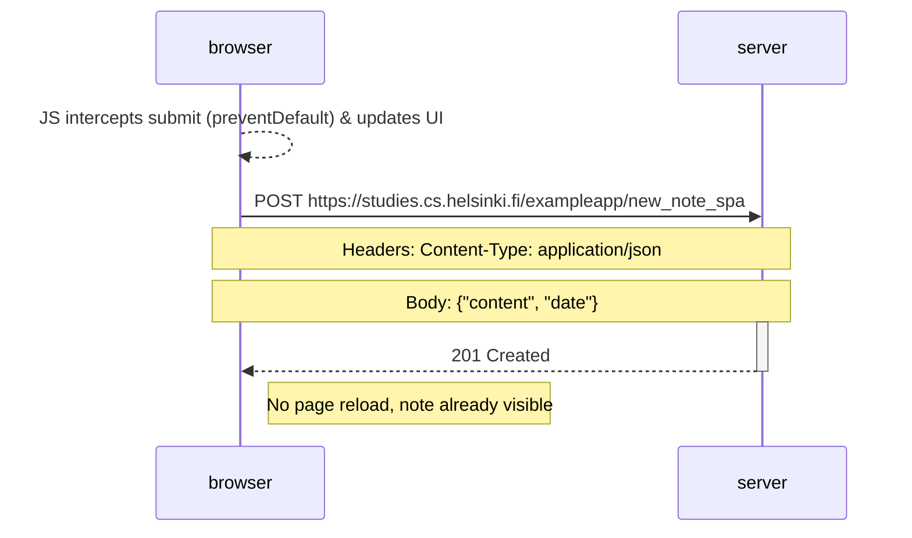

```mermaid

sequenceDiagram
  participant browser
  participant server

  browser-->>browser: JS intercepts submit (preventDefault) & updates UI
  browser->>server: POST https://studies.cs.helsinki.fi/exampleapp/new_note_spa
  Note over browser,server: Headers: Content-Type: application/json
  Note over browser,server: Body: {"content", "date"}

  activate server
  server-->>browser: 201 Created
  deactivate server

  Note right of browser: No page reload, note already visible
```
